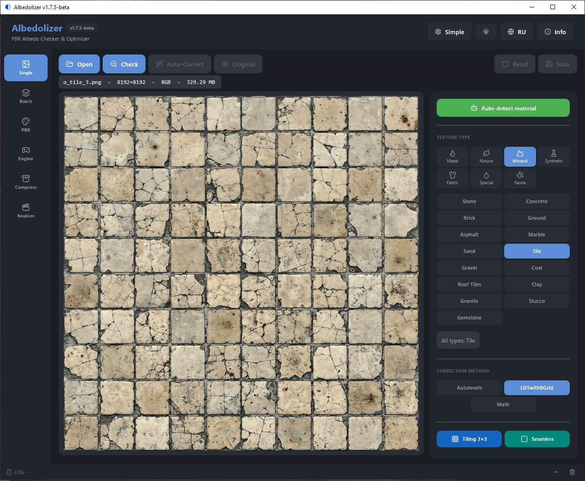

# Albedolizer

**PBR Albedo Checker & Optimizer** — a tool for checking, correcting, and generating PBR maps from Albedo textures.

[🇷🇺 Русская версия ниже](#русская-версия)

---

## What is it

Albedolizer is a tool for 3D artists, game designers, and anyone working with PBR textures. It checks Albedo maps against standards, automatically corrects color via an AI model, generates a full set of PBR maps, packs them for a target engine, and lets you preview the result in a built-in 3D viewer.

---

## Add-ons

Albedolizer is also available right inside **Blender**, **Unity** and **Godot** — same engine, same result, free.

### Albedolizer-Blender
Free Blender add-on that generates 7 PBR maps from Albedo textures directly in the N-Panel. AI correction, 50 presets, seamless, batch, auto-wired Principled BSDF nodes, engine packing.

- GitHub: https://github.com/invisiblelevel/Albedolizer-Blender
- itch.io: https://invlvl.itch.io/albedolizer-blender
- License: GPL-3.0-or-later

### Albedolizer-Unity
Free Unity Editor add-on that generates PBR maps and auto-creates URP/Lit materials with proper channel packing (R=Metallic, G=AO, A=Smoothness). Supports HDRP / Unreal / Godot packing.

- GitHub: https://github.com/invisiblelevel/Albedolizer-Unity
- Install via UPM Git URL: `https://github.com/invisiblelevel/Albedolizer-Unity.git`
- License: MIT

### Albedolizer-Godot
Free Godot Editor add-on that generates PBR maps and auto-creates StandardMaterial3D with proper channel packing (R=Metallic, G=AO, A=Smoothness).

- GitHub: https://github.com/invisiblelevel/Albedolizer-Godot
- License: MIT

---

## Screenshots

## What's new in v1.7.5-beta

### New interface
- **All UI emoji replaced with Lucide SVG icons** — thin line icons (1.75px stroke) instead of system emoji glyphs
- **Unified `make_toggle` helper** — active state is now always accent background + white content, no more "blue on blue" bug
- **Consistent button states** — buttons re-render from state on every action, no stale disabled states
- **Presets use text-only chips** — no icons on preset buttons, cleaner and more compact
- **Rail, header, tabs, log panel** — everything on Lucide

### Internal refactoring
- **`main.py` split into `core/` and `ui/` packages** — was ~5000 lines, now ~500
- **`core/state.py`** — state dict, settings persistence
- **`core/io.py`** — file save/load helpers
- **`core/image_ops.py`** — image processing wrappers
- **`ui/theme.py`** — colors, fonts, `Btn` class, `make_btn`, `make_toggle`
- **`ui/icons.py`** — ~65 Lucide SVG icons inline
- **`ui/tab_*.py`** — one module per tab (Single, PBR, Export, Realism, Batch, Compress)
- **`ui/dialogs.py`** — Info, Welcome, Compress-done, Fallback dialogs
- **`ui/header.py`, `ui/rail.py`, `ui/log_panel.py`** — header, navigation, log panel
- **`ui/helpers.py`** — log, stats, progress helpers

### Fixed
- **LUTwithBGrid on 8K textures** — `max_pixels` raised from 16M to 32M, no more downscale on large textures
- **Unity URP pack** — AO is now correctly placed in G channel (`R=Metallic, G=AO, B=0, A=Smoothness`). Previously G channel was empty.
- **CLI: seamless flags** — `--seamless`, `--seamless-hipass`, `--seamless-no-hipass`
- **CLI: OSError handling** — clear hint on long paths, permissions, disk issues

---

## Features

### Albedo Analysis
- Dark and light pixel check against standards for each texture type
- Problem zone visualization (heatmap)
- Detailed statistics: min / max / avg / median / percentiles
- **Soap removal** — adaptive unsharp mask that fixes blurry patches after AI correction or upscaling

### AI Auto-Correction
- **Three methods:** Autolevels (XCiT model), LUTwithBGrid (ECCV 2024, ONNX), or Math (CLAHE + soft-clip)
- **Switch models** in the sidebar — pick what works best for your texture
- **Material auto-detection** — CLIP-based classifier (ViT-B/32) automatically picks the right preset from 50 options
- Fallback dialog if AI result doesn't pass validation
- **Saturation boost** — fix washed-out colors after AI correction

### PBR Map Generation
- **Height** — height map
- **Normal** — normals (Sobel-based)
- **AO** — ambient occlusion
- **Roughness** — surface roughness (procedural or custom map, 4-signal advanced)
- **Metallic** — metalness (black / white / custom map / color pick)
- **ORM** — packed map (AO in R, Roughness in G, Metallic in B)
- **Edge** — edge map (Sobel via OpenCV)
- **Per-map bit depth** — each map in its own 8/16-bit PNG

### Engine Export
- **Unity HDRP** Mask Map — R=Metallic, G=AO, B=Detail Mask, A=Smoothness
- **Unity URP** MetallicSmoothness — R=Metallic, G=AO, A=Smoothness
- **Unreal ORM** — R=AO, G=Roughness, B=Metallic
- **Godot ORM** — R=AO, G=Roughness, B=Metallic
- **Normal map format** — OpenGL (Y+) / DirectX (Y-) with green channel flip
- **Detail Mask** for HDRP — white (1.0) / edge map / custom loaded from disk
- **Channel preview** — R / G / B / A / RGB / RGBA
- **Source:** current PBR result or a folder with `*_albedo.png`, `*_normal.png`, `*_ao.png`, etc.

### Realism Filter
- **Procedural photorealism** — adds camera-like imperfection to albedo textures
- **Grain** — fine and coarse noise layers
- **Detail** — adaptive high-pass overlay for micro-detail
- **Variation** — large-scale color/brightness patches + subtle vignette
- **Tileable noise** — noise pattern can be tiled without visible seams
- **Presets** — Soft / Medium / Hard one-click

### Built-in 3D Viewer
- Real-time PBR preview via OpenGL (`viewer.exe`)
- **4 shapes:** Sphere / Cylinder / Cube / Plane
- **Substance-style lighting** — key + fill + rim, ACES tone mapping, exposure slider
- **Tiling panel** — click X/Y buttons in the window to change texture scale (1×1 to 16×16)
- Rotate with LMB, zoom with mouse wheel
- Powered by Moderngl + GLFW + ImGui
- HDRI environment lighting with blurred reflections
- Viewer UI language follows the app language

### Built-in Manual
- Full HTML manual with screenshots and annotations
- **Russian / English** — switch inside the manual (RU / EN buttons, remembers your choice)
- Opens in your browser from the **Info → Manual** button

### 50 Texture Presets in 7 Categories
**Metal** · **Nature** · **Mineral** · **Synthetic** · **Fabric** · **Special** · **Fauna**

### Batch Processing
- Process folders or file lists
- Two modes: AI correction or compression
- **Threads slider** — control parallelism (1–8)
- Progress bar with ETA

### Themes & Modes
- Dark and light theme with one-click toggle
- **Simple / Advanced modes** — one-click workflow or full control
- Tiling checker (3×3 preview) to spot seams

### Interface
- Russian / English with auto-detection
- Interactive preview with zoom (0.5x–8x)
- **Global hotkeys** — Ctrl+O, Ctrl+S, Ctrl+R, Ctrl+Z, Space, Enter
- **Last opened folder is remembered** across sessions
- **Settings persistence** — all key options saved to `config.json`

---

## Installation

### Installer (recommended)

1. Download `Albedolizer_Setup_v1.7.5-beta.exe` from the [latest release](../../releases/latest)
2. Run the installer — it places everything in `Program Files\Albedolizer`
3. Launch from Start Menu or Desktop shortcut

**Requirements:** Windows 10/11, 64-bit

### From source

    git clone https://github.com/invisiblelevel/Albedolizer.git
    cd Albedolizer
    pip install -r requirements.txt
    python main.py

---

## Usage

### Single file processing
1. Pick a **texture type** on the right (e.g. Wood)
2. Click **Open** and select an Albedo texture
3. Click **Check** — you'll see stats and heatmap
4. If FAIL → **Auto-Correct** (AI + fallback)
5. **Save** the result
6. **Original / Result** — toggle preview between original and corrected

### PBR generation + 3D preview
1. **PBR** tab
2. **Load Albedo**
3. Pick a **preset** (sliders auto-tune)
4. Adjust sliders if needed
5. Optional: **Metal** → **By color** → pick on Albedo
6. **Generate** → 7 maps
7. Switch between maps with buttons on top — right panel changes per map
8. **3D Preview** — opens the OpenGL viewer
9. **Save all** — creates a `<name>_pbr/` folder

### Engine Export
1. **Engine** tab
2. **From current PBR** (uses your last generated maps) or **Load from folder**
3. Pick **engine:** Unity HDRP / URP / Unreal / Godot
4. Pick **normal map format:** OpenGL (Y+) or DirectX (Y-)
5. For HDRP — pick **Detail Mask:** white / edge / custom
6. **Pack** — see the packed map in the preview
7. Switch channels: **R / G / B / A / RGB / RGBA**
8. **Save all** — creates `<name>_<engine>_<gl|dx>/`

### Realism filter
1. **Realism** tab
2. **Open** — load a texture
3. Click preset: **Soft** / **Medium** / **Hard**
4. Or adjust three sliders manually: **grain**, **detail**, **variation**
5. **Apply** — see the result in the preview
6. **Save** the result

### Batch processing
1. **Batch** tab
2. **Select folder** or **Select files**
3. Choose correction method (Autolevels / LUTwithBGrid / Math) on the right
4. Set **threads** count (1–8)
5. **Run processing**
6. Output goes to `_corrected` folder next to sources

### Compression
1. **Compress** tab
2. **Open** for single file, or **Select folder** for batch
3. Choose **8-bit** or **16-bit** PNG on the right
4. **Compress** or **Compress folder**
5. Output to `_compressed` folder next to sources
6. After save — see size delta: `12.4 MB → 8.1 MB (−4.3 MB, −34.7%)`

### Manual
Click **Info** in the header → **Manual** tab.

---

## Tech Stack

- **[Flet](https://flet.dev/)** — cross-platform UI in Python
- **[NumPy](https://numpy.org/)** — math and array operations
- **[Pillow](https://python-pillow.org/)** — image processing
- **[OpenCV](https://opencv.org/)** — Sobel filters, HSV manipulation
- **[Moderngl](https://moderngl.readthedocs.io/)** + **[GLFW](https://www.glfw.org/)** + **[imgui-bundle](https://pypi.org/project/imgui-bundle/)** — 3D viewer with in-window controls
- **[ONNX Runtime](https://onnxruntime.ai/)** — inference for CLIP and LUTwithBGrid
- **[Transformers](https://huggingface.co/docs/transformers/)** + **[Tokenizers](https://huggingface.co/docs/tokenizers/)** — CLIP tokenizer
- **Autolevels** (XCiT-tiny) — AI color correction model

---

## Credits

- **LUTwithBGrid** (ECCV 2024) — Wontae Kim, Nam Ik Cho — [Apache 2.0](https://github.com/WontaeaeKim/LUTwithBGrid)
- **GIMP tile-seamless** (1997) — Tim Rowley — GPL (algorithm ported)
- **[Lucide](https://lucide.dev/)** — icon set (ISC License)

## Contributing

Pull requests are welcome. For major changes, please open an issue first to discuss what you'd like to change.

---

## License

MIT — free to use, including in commercial projects.

---

**Author:** INV.LVL  
**Version:** 1.7.5-beta  
**Date:** 2026

---

 
 

# Albedolizer

**PBR Albedo Checker & Optimizer** — утилита для проверки, коррекции и генерации PBR-карт из Albedo-текстур.

---

## Что это

Albedolizer — инструмент для 3D-художников, геймдизайнеров и всех, кто работает с PBR-текстурами. Он проверяет Albedo-карты на соответствие стандартам, автоматически корректирует цвет через AI-модель, генерирует полный набор PBR-карт, упаковывает их под конкретный движок и позволяет посмотреть результат во встроенном 3D-вьюере.

---

## Аддоны

Albedolizer также доступен прямо внутри **Blender**, **Unity** и **Godot** — тот же движок, тот же результат, бесплатно.

### Albedolizer-Blender
Бесплатный Blender-аддон, который генерирует 7 PBR-карт из Albedo прямо в N-панели. AI-коррекция, 50 пресетов, seamless, batch, автосборка нод к Principled BSDF, упаковка под движки.

- GitHub: https://github.com/invisiblelevel/Albedolizer-Blender
- itch.io: https://invlvl.itch.io/albedolizer-blender
- Лицензия: GPL-3.0-or-later

### Albedolizer-Unity
Бесплатный Unity Editor-аддон, который генерирует PBR-карты и автосоздаёт URP/Lit материалы с правильной упаковкой каналов (R=Metallic, G=AO, A=Smoothness). Поддержка HDRP / Unreal / Godot.

- GitHub: https://github.com/invisiblelevel/Albedolizer-Unity
- Установка через UPM Git URL: `https://github.com/invisiblelevel/Albedolizer-Unity.git`
- Лицензия: MIT

### Albedolizer-Godot
Бесплатный Godot Editor-аддон, который генерирует PBR-карты и автосоздаёт StandardMaterial3D с правильной упаковкой каналов (R=Metallic, G=AO, A=Smoothness).

- GitHub: https://github.com/invisiblelevel/Albedolizer-Godot
- Лицензия: MIT

---

## Что нового в v1.7.5-beta

### Новый интерфейс
- **Все эмодзи в UI заменены на Lucide SVG-иконки** — тонкие линейные иконки (толщина 1.75px) вместо системных эмодзи
- **Единый хелпер `make_toggle`** — активное состояние теперь всегда accent-фон + белый контент, больше нет бага «синее на синем»
- **Консистентные состояния кнопок** — кнопки перерисовываются из state при каждом действии, никаких залипших disabled
- **Пресеты — только текст** — без иконок на кнопках пресетов, чище и компактнее
- **Rail, хедер, табы, лог-панель** — всё на Lucide

### Внутренний рефакторинг
- **`main.py` разбит на пакеты `core/` и `ui/`** — было ~5000 строк, стало ~500
- **`core/state.py`** — словарь состояния, сохранение настроек
- **`core/io.py`** — хелперы сохранения/загрузки
- **`core/image_ops.py`** — обёртки обработки изображений
- **`ui/theme.py`** — цвета, шрифты, класс `Btn`, `make_btn`, `make_toggle`
- **`ui/icons.py`** — ~65 Lucide SVG-иконок инлайн
- **`ui/tab_*.py`** — один модуль на вкладку (Single, PBR, Export, Realism, Batch, Compress)
- **`ui/dialogs.py`** — Info, Welcome, Compress-done, Fallback диалоги
- **`ui/header.py`, `ui/rail.py`, `ui/log_panel.py`** — хедер, навигация, лог
- **`ui/helpers.py`** — лог, статистика, прогресс

### Исправлено
- **LUTwithBGrid на 8K-текстурах** — `max_pixels` поднят с 16M до 32M, больше нет downscale на больших текстурах
- **Unity URP pack** — AO теперь корректно в G-канале (`R=Metallic, G=AO, B=0, A=Smoothness`). Раньше G-канал был пустой.
- **CLI: seamless флаги** — `--seamless`, `--seamless-hipass`, `--seamless-no-hipass`
- **CLI: обработка OSError** — понятный hint при длинных путях, правах, проблемах с диском

---

## Возможности

### Анализ Albedo
- Проверка тёмных и светлых пикселей по стандартам для каждого типа текстуры
- Визуализация проблемных зон (heatmap)
- Детальная статистика: min / max / avg / median / перцентили
- **Устранение «мыла»** — адаптивный unsharp mask, чинит размытые участки после AI-коррекции

### AI-автокоррекция
- **Три метода:** Autolevels (модель XCiT), LUTwithBGrid (ECCV 2024, ONNX) или Math (CLAHE + soft-clip)
- **Переключай модели** в сайдбаре — выбирай что лучше для твоей текстуры
- **Автоопределение материала** — CLIP-классификатор (ViT-B/32) сам подбирает пресет из 50 доступных
- Диалог выбора если AI не прошёл валидацию
- **Насыщенность** — фикс блеклых цветов после AI-коррекции

### Генерация PBR-карт
- **Height** — карта высот
- **Normal** — нормали (на основе Sobel)
- **AO** — ambient occlusion
- **Roughness** — шероховатость (процедурная или своя карта, 4-сигнальный advanced)
- **Metallic** — металличность (чёрная / белая / своя карта / по цвету)
- **ORM** — упакованная карта (AO в R, Roughness в G, Metallic в B)
- **Edge** — карта граней (Sobel через OpenCV)
- **Per-map битность** — каждая карта в своей 8/16-bit PNG

### Экспорт для движков
- **Unity HDRP** Mask Map — R=Metallic, G=AO, B=Detail Mask, A=Smoothness
- **Unity URP** MetallicSmoothness — R=Metallic, G=AO, A=Smoothness
- **Unreal ORM** — R=AO, G=Roughness, B=Metallic
- **Godot ORM** — R=AO, G=Roughness, B=Metallic
- **Формат Normal** — OpenGL (Y+) / DirectX (Y-) с инверсией зелёного канала
- **Detail Mask** для HDRP — белая (1.0) / edge-карта / своя с диска
- **Просмотр каналов** — R / G / B / A / RGB / RGBA
- **Источник:** текущий PBR-результат или папка с `*_albedo.png`, `*_normal.png`, `*_ao.png` и т.д.

### Фильтр реализма
- **Процедурный фотореализм** — добавляет текстуре «неидеальность» как на фото
- **Grain** — мелкое и крупное зерно
- **Detail** — адаптивный high-pass для микро-деталей
- **Variation** — крупные пятна цвета/яркости + лёгкая виньетка
- **Тайлящийся шум** — паттерн не создаёт видимых швов при тайлинге
- **Пресеты** — Мягкий / Средний / Жёсткий в один клик

### Встроенный 3D-вьюер
- Просмотр PBR в реальном времени через OpenGL (`viewer.exe`)
- **4 формы:** Sphere / Cylinder / Cube / Plane
- **Освещение как в Substance** — key + fill + rim, ACES tone mapping, слайдер экспозиции
- **Панель тайлинга** — кнопки X/Y прямо в окне, масштаб от 1×1 до 16×16
- Вращение ЛКМ, зум колесом
- На базе Moderngl + GLFW + ImGui
- HDRI-освещение с размытыми отражениями
- Язык панели следует за языком приложения

### Встроенный мануал
- Полный HTML-мануал со скринами и разметкой
- **Русский / English** — переключение внутри мануала (кнопки RU / EN, выбор запоминается)
- Открывается из **Info → Мануал**

### 50 пресетов текстур в 7 категориях
**Металл** · **Природа** · **Минерал** · **Синтетика** · **Ткани** · **Спецэффекты** · **Фауна**

### Пакетная обработка
- Обработка папок или списка файлов
- Два режима: AI-коррекция или сжатие
- **Слайдер потоков** — управление параллелизмом (1–8)
- Прогресс-бар с ETA

### Темы и режимы
- Тёмная и светлая тема одной кнопкой
- **Simple / Advanced режимы** — workflow в одну кнопку или полный контроль
- Тайлинг-чекер (3×3) для поиска швов

### Интерфейс
- Русский / English с автоопределением системы
- Интерактивное превью с зумом (0.5x–8x)
- **Глобальные хоткеи** — Ctrl+O, Ctrl+S, Ctrl+R, Ctrl+Z, Space, Enter
- **Запоминается последняя открытая папка** между сессиями
- **Сохранение настроек** — все ключевые опции в `config.json`

---

## Установка

### Инсталлер (рекомендуется)

1. Скачай `Albedolizer_Setup_v1.7.5-beta.exe` из [последнего релиза](../../releases/latest)
2. Запусти установщик — всё встанет в `Program Files\Albedolizer`
3. Запускай из меню Пуск или ярлыка на рабочем столе

**Требования:** Windows 10/11, 64-bit

### Из исходников

    git clone https://github.com/invisiblelevel/Albedolizer.git
    cd Albedolizer
    pip install -r requirements.txt
    python main.py

---

## Как пользоваться

### Одиночная обработка
1. Выбери **тип текстуры** справа (например, Дерево)
2. Нажми **Open** и выбери Albedo-текстуру
3. Нажми **Check** — увидишь статистику и heatmap
4. Если FAIL → **Auto-Correct** (AI + fallback)
5. **Save** результат
6. **Оригинал / Результат** — переключение превью

### PBR-генерация + 3D-превью
1. Вкладка **PBR**
2. **Load Albedo**
3. Выбери **пресет** (слайдеры настроятся автоматически)
4. При необходимости подкрути параметры
5. Опционально: **Metal** → **By color** → ткни в Albedo
6. **Generate** → 7 карт
7. Переключайся между картами — правая панель меняется под карту
8. **3D Preview** — открывает OpenGL-вьюер
9. **Save all** — создастся папка `<имя>_pbr/`

### Экспорт для движков
1. Вкладка **Engine**
2. **From current PBR** (берёт последние сгенерированные карты) или **Load from folder**
3. Выбери **движок:** Unity HDRP / URP / Unreal / Godot
4. Выбери **формат Normal:** OpenGL (Y+) или DirectX (Y-)
5. Для HDRP — выбери **Detail Mask:** white / edge / custom
6. **Pack** — увидишь упакованную карту в превью
7. Переключай каналы: **R / G / B / A / RGB / RGBA**
8. **Save all** — создастся папка `<имя>_<движок>_<gl|dx>/`

### Фильтр реализма
1. Вкладка **Realism**
2. **Open** — загрузи текстуру
3. Кликни пресет: **Мягкий** / **Средний** / **Жёсткий**
4. Или крути три слайдера вручную: **Grain**, **Detail**, **Variation**
5. **Apply** — результат в превью
6. **Save** результат

### Пакетная обработка
1. Вкладка **Batch**
2. **Select folder** или **Select files**
3. Выбери метод коррекции справа (Autolevels / LUTwithBGrid / Math)
4. Задай **потоки** (1–8)
5. **Run processing**
6. Результат в папке `_corrected` рядом с исходниками

### Сжатие
1. Вкладка **Compress**
2. **Open** для одного файла или **Select folder** для пакета
3. Выбери **8-bit** или **16-bit** PNG справа
4. **Compress** или **Compress folder**
5. Результат в папке `_compressed` рядом с исходниками
6. После сохранения — размер до/после: `12.4 MB → 8.1 MB (−4.3 MB, −34.7%)`

### Мануал
Нажми **Info** в хедере → вкладка **Manual**.

---

## Технологии

- **[Flet](https://flet.dev/)** — кроссплатформенный UI на Python
- **[NumPy](https://numpy.org/)** — математика и работа с массивами
- **[Pillow](https://python-pillow.org/)** — работа с изображениями
- **[OpenCV](https://opencv.org/)** — Sobel-фильтры, HSV-манипуляции
- **[Moderngl](https://moderngl.readthedocs.io/)** + **[GLFW](https://www.glfw.org/)** + **[imgui-bundle](https://pypi.org/project/imgui-bundle/)** — 3D-вьюер с внутриоконными контролами
- **[ONNX Runtime](https://onnxruntime.ai/)** — инференс CLIP и LUTwithBGrid
- **[Transformers](https://huggingface.co/docs/transformers/)** + **[Tokenizers](https://huggingface.co/docs/tokenizers/)** — CLIP-токенайзер
- **Autolevels** (XCiT-tiny) — AI-модель цветокоррекции

---

## Благодарности

- **LUTwithBGrid** (ECCV 2024) — Wontae Kim, Nam Ik Cho — [Apache 2.0](https://github.com/WontaeaeKim/LUTwithBGrid)
- **GIMP tile-seamless** (1997) — Tim Rowley — GPL (алгоритм портирован)
- **[Lucide](https://lucide.dev/)** — набор иконок (ISC License)

## Вклад

Pull requests приветствуются. Для крупных изменений сначала откройте issue для обсуждения.

---

## Лицензия

MIT — используйте свободно, в том числе в коммерческих проектах.

---

**Автор:** INV.LVL  
**Версия:** 1.7.5-beta  
**Дата:** 2026